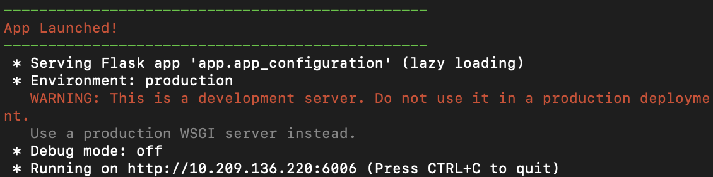
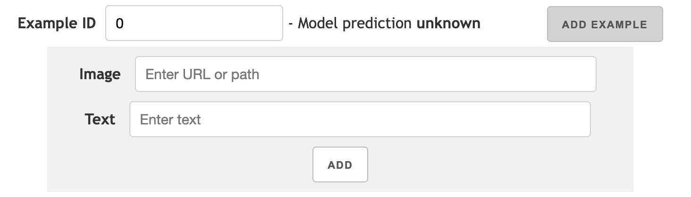

<p align="center">
  
</p>


VL-InterpreT provides interactive visualizations for interpreting the attentions and hidden representations in vision-language transformers. It is a task agnostic and integrated tool that:
- Tracks a variety of statistics in attention heads throughout all layers for both vision and language components
- Visualizes cross-modal and intra-modal attentions through easily readable heatmaps
- Plots the hidden representations of vision and language tokens as they pass through the transformer layers.

# Paper
Our paper won the Best Demo Award at CVPR 2022: <a href="https://arxiv.org/abs/2203.17247" target="_blank">VL-InterpreT: An Interactive Visualization Tool for Interpreting Vision-Language Transformers</a>

# Screencast Video
This video provides an overview of VL-Interpret and demonstrates a few interesting examples.

<p align="center">
  <a href="https://youtu.be/4Rj15Hi_Pdo" target="_blank"></a>
</p>

# Live Demo
A live demo of the app (same as in the screencast video) is available <a href="http://vlinterpret38-env-2.eba-bgxp4fxk.us-east-2.elasticbeanstalk.com/" target="_blank">here</a>.

Please watch <a href="https://youtu.be/4Rj15Hi_Pdo" target="_blank">the screencast video</a> to get a sense of how to navigate the app. This demo contains 100 examples from the <a href="https://visualcommonsense.com/" target="_blank">Visual Commonsense Reasoning task</a> and shows the attention and hidden representations from the <a href="https://arxiv.org/abs/2109.10504" target="_blank">KD-VLP model</a>.

# Setup and Usage
You may run VL-InterpreT together with a model of your own choice (see [*Set up a live model*](#set-up-a-live-model)), and/or with a database that contains data extracted from a model.

To run VL-InterpreT with our example databases, please first clone this repository and install the dependencies. For example:
```bash
git clone https://github.com/IntelLabs/VL-InterpreT.git
# create and activate your virtual environment if needed, then:
cd VL-InterpreT
pip install -r requirements.txt
```

Then you can run VL-InterpreT (replace 6006 with any port number you prefer):
```bash
python run_app.py --port 6006 --database example_database2
# alternatively:
python run_app.py -p 6006 -d example_database2
```

We have included two example databases in this repository. `example_database1` contains grey "images" and randomly generated data, and `example_database2` contains one example image+text pair that was processed by the KD-VLP model.

Once the app runs, it will show the IP address where the app is running on. Open it in your browser to use VL-InterpreT:

<p align="center">
  
</p>


## Set up a database
You may extract data from a transformer in a specific format, and then use VL-InterpreT to visualize them interactively.

To set up such a database, please see [db_example.py](), which is an example script that creates a database (i.e., `example_database1`) with randomly generated data. To prepare the data from your own transformer, for each image+text pair you should mainly:
-  Extract cross-attention weights and hidden representation vectors from your transformer
    - For example, you may extract them from [a Huggingface model](https://huggingface.co/transformers/v3.0.2/model_doc/bert.html#transformers.BertModel.forward) by specifying `output_attentions=True` and `output_hidden_states=True`.
- Get the original input image as an array, and input tokens as a list of strings (text tokens followed by image tokens, where image tokens can be named at your discretion, e.g., "img_0", "img_1", etc.).
- For the input image tokens, specify how they corresponds to the positions in the original image, assuming the top left corner has coordinates (0, 0).

Please refer to [db_example.py]() for more details. You may also look into our `example_database1` and `example_database2` for example databases that have been preprocessed.

Once you prepared the data as specified, organize them in the following format (again, see [db_example.py]() for the specifics):
```python
data = [
  {  # first example
    'ex_id': 0,
    'image': np.array([]),
    'tokens': [],
    'txt_len': 0,
    'img_coords': [],
    'attention': np.array([]),
    'hidden_states': np.array([])
  },
  {  # second example
    'ex_id': 1,
    'image': np.array([]),
    'tokens': [],
    'txt_len': 0,
    'img_coords': [],
    'attention': np.array([]),
    'hidden_states': np.array([])
  },
  # ...
]
```
Then run the following code from the `app/database` directory to create and preprocess your database:
```python
import pickle
from database import VliLmdb  # this is in app/database/database.py

# create a database
db = VliLmdb(db_dir='path_to_your_database', read_only=False)
# add data
for ex_data in data:
    db[str(ex_data['ex_id'])] = pickle.dumps(ex_data, protocol=pickle.HIGHEST_PROTOCOL)
# preprocess the database
db.preprocess()
```
Now you can visualize your data with VL-InterpreT:
```bash
python run_app.py -p 6006 -d path_to_your_database
```

## Set up a live model
You may also run a live transformer model together with VL-InterpreT. This way, the `Add example` functionality will become available on the web app -- users can add image+text pairs for the transformer to process them in real time and for VL-InterpreT to visualize the process:

<p align="center">
  
</p>

To add a model, you will need to define your own model class that inherits from the [VL_Model]() base class, and then implement a `data_setup` function in this class. This function should run a forward pass with your model given the input image+text pair, and return data (e.g., attention weights, hidden state vectors, etc.) in the required format. The return data format is the same as what was specified in [*Set up a database*](#set-up-a-database) and in [db_example.py](). **Please see [vl_model.py]() for more details**. You may also refer to [kdvlp.py]() for an example model class.

Additionally, please start with the following naming pattern for your script and class, to make sure your model runs easily with VL-InterpreT:
  - Create a new python script in `app/database/models` for your model class, and name it in all lowercase (e.g., `app/database/models/yourmodelname.py`)
  - Name your model class in title case, e.g., `class Yourmodelname`. This class name should be the result of calling `'yourmodelname'.title()`, where `'yourmodelname.py'` is the name of your python script.
  - For example, our KD-VLP model class is defined in `app/database/models/kdblp.py`, and named `class Kdvlp`.

Once your implementation is completed, you can run VL-InterpreT with your model using:
```bash
python run_app.py --port 6006 --database example_database2 --model yourmodelname your_model_parameters
# alternatively:
python run_app.py -p 6006 -d example_database2 -m yourmodelname your_model_parameters
```

Note that the `__init__` method of your model class may take an arbituary number of parameters, and you may specify these parameters when running VL-InterpreT by putting them after the name of your model (i.e., replacing `your_model_parameters`).
