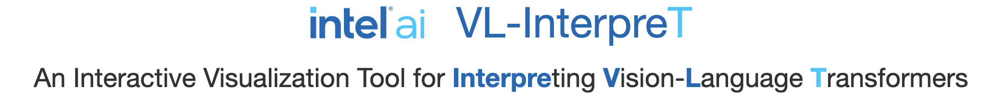
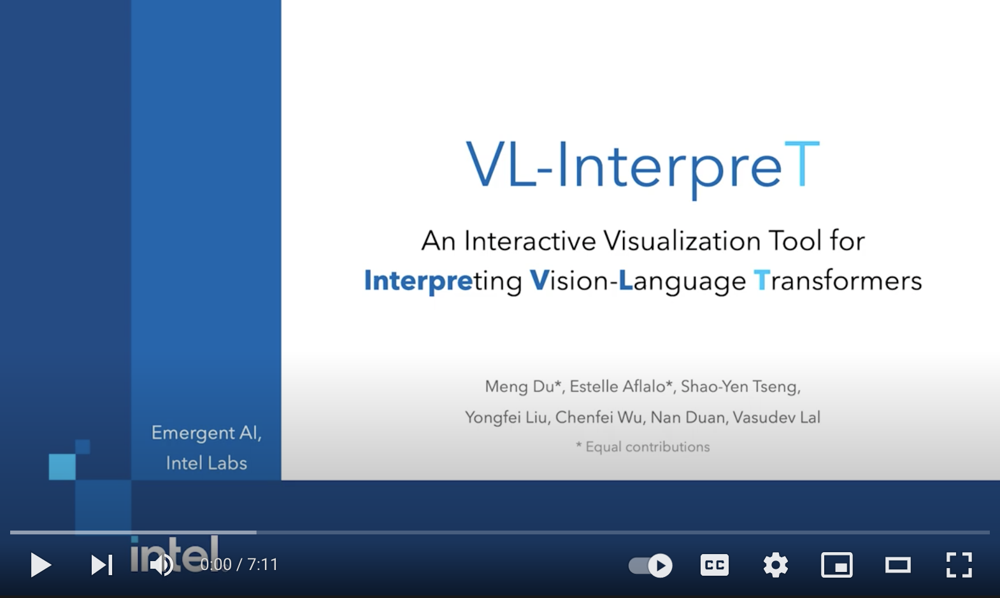

  

VL-InterpreT provides interactive visualizations for interpreting the attentions and hidden representations in vision-language transformers. It is a task agnostic and integrated tool that:
- Tracks a variety of statistics in attention heads throughout all layers for both vision and language components
- Visualizes cross-modal and intra-modal attentions through easily readable heatmaps
- Plots the hidden representations of vision and language tokens as they pass through the transformer layers.

# Paper
Our demo was accepted to CVPR 2022: [VL-InterpreT: An Interactive Visualization Tool for Interpreting Vision-Language Transformers
](https://arxiv.org/abs/2203.17247)

# Screencast Video
This video provides an overview of VL-Interpret and demonstrates a few interesting examples.

  

# Live Demo
A live demo of the app (same as in the screencast video) is available at http://vlinterpretenv4env-env.eba-vmhhefup.us-east-2.elasticbeanstalk.com. Please watch [the screencast video](https://youtu.be/4Rj15Hi_Pdo) to get a sense of how to navigate the app. This demo contains 100 examples from the [Visual Commonsense Reasoning task](https://visualcommonsense.com/) and shows the attention and hidden representations from the [KD-VLP model](https://arxiv.org/abs/2109.10504).

<!-- ## Run VL-Interpret with Your Own Data -->
 
